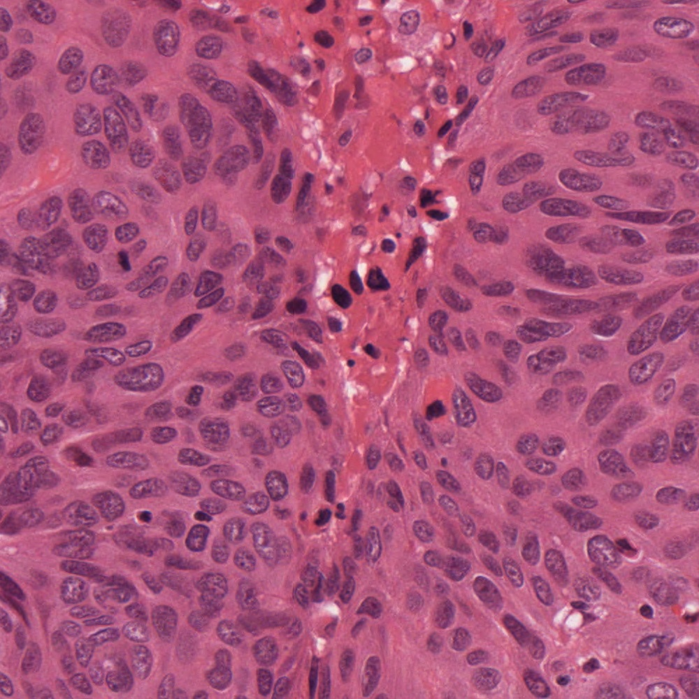
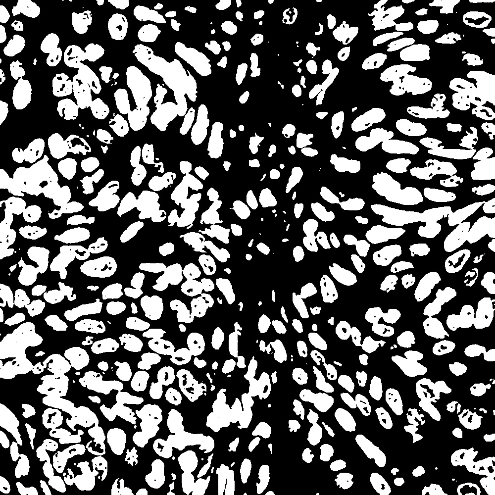
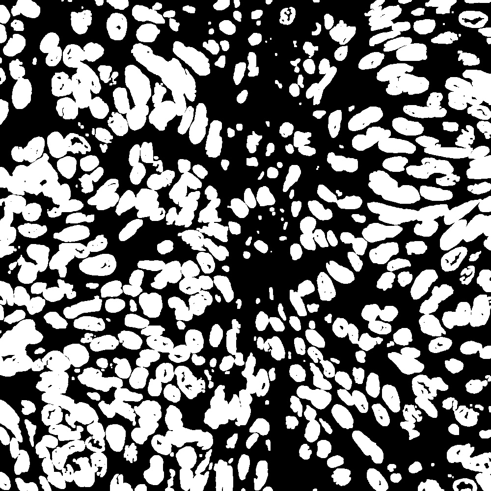
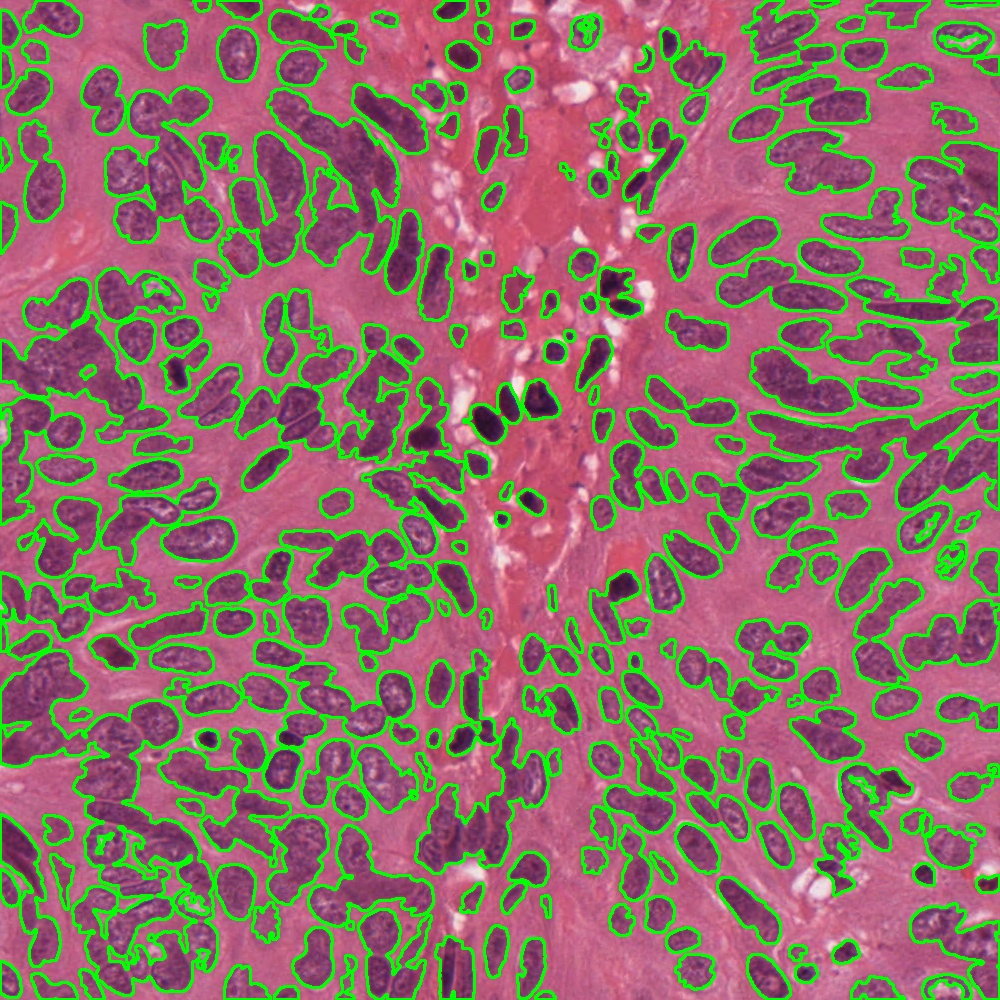
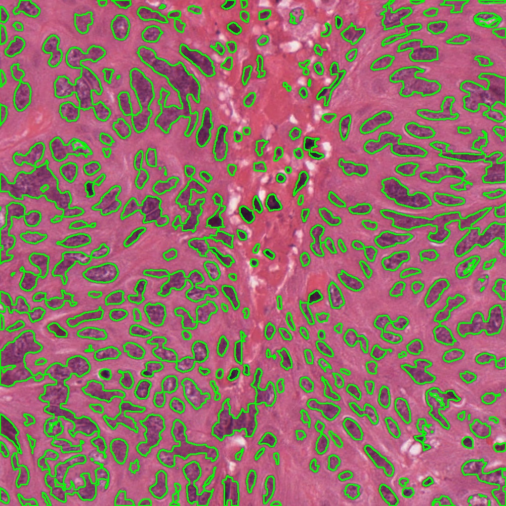
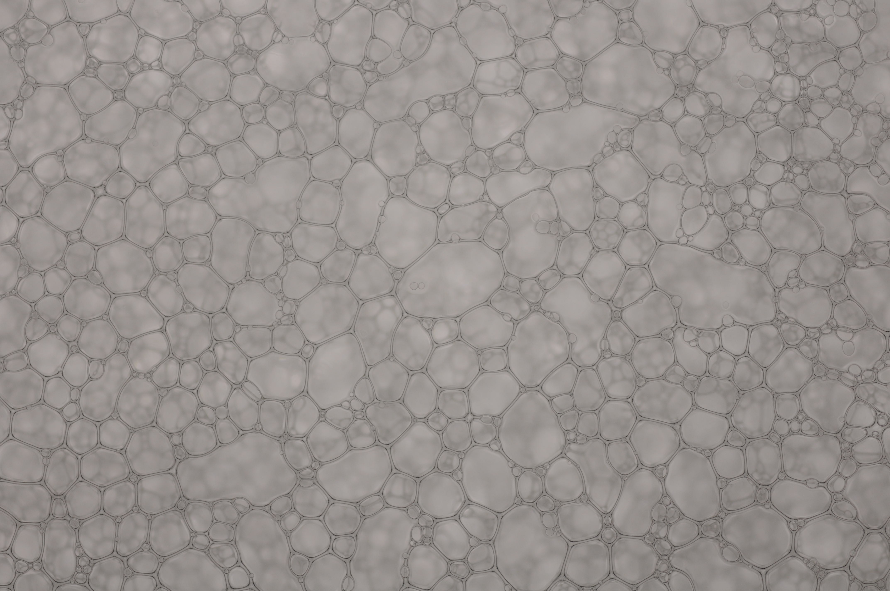
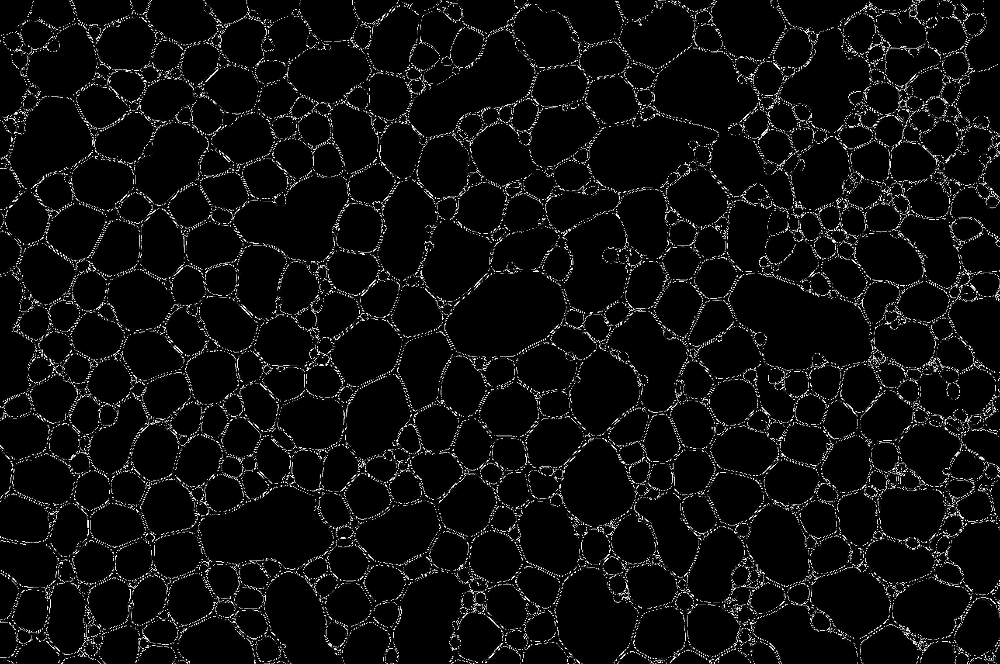
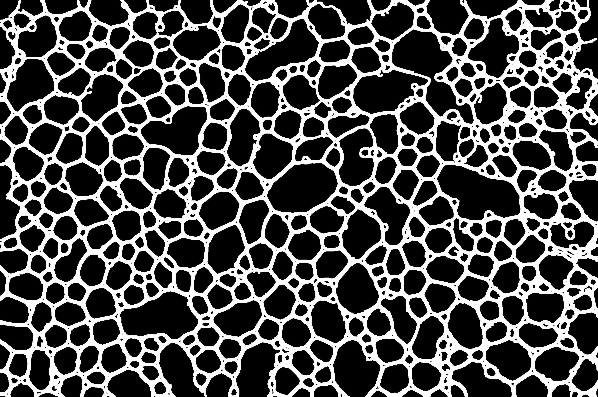
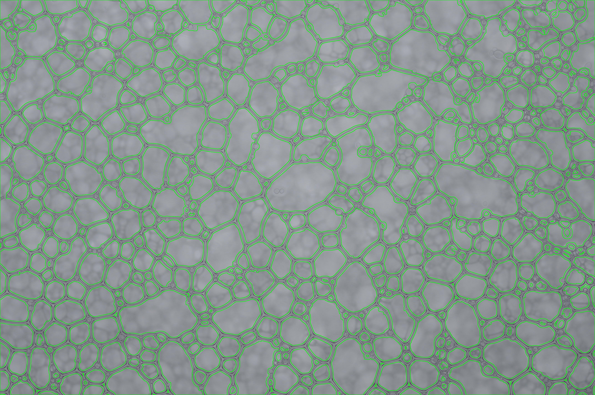

# Assignment_1: Mark and sum the total count of cells in the image
## Name: Ján Balucha
## Important methods
<table>
    <tr>
        <td>cv2.imread</td>
        <td>cv2.GaussianBlur</td>
        <td>cv2.contourArea</td>
        <td>cv2.dilate</td>
    </tr>
    <tr>
        <td>cv2.imwrite</td>
        <td>cv2.Canny</td>
        <td>cv2.findContours</td>
        <td>cv2.erode</td>
    </tr>
    <tr>
        <td>cv2.cvtColor</td>
        <td>cv2.inRange</td>
        <td>cv2.drawContours</td>
        <td>cv2.fillPoly</td>
    </tr>
</table>

## Breast cancer:
In this task we started with following image:



Our task was to find and count the number of cells (purple spots) in the image. 
To do this we used HSV color space to create mask of the cells,
we also used gaussian blur with kernel size (5,5) to smooth edges.
```python
img = cv2.imread('bc.tif')
img = cv2.cvtColor(img, cv2.COLOR_BGR2HSV)
img = cv2.GaussianBlur(img,(5,5),cv2.BORDER_DEFAULT)
plt.imshow(img, cmap='gray', interpolation='bicubic')
```

Parameters were chosen by trial and error in jupyter notebook,
where we could load the image and adjust H, S and V values with sliders.
Code example for finding the mask, full code can be found in file: hsv_inrange.ipynb
```python
low =  (h_min, s_min, v_min)
high = (h_max, s_max, v_max)
out = cv2.inRange(img, low, high)
cv2.imshow("Mask", out)
```
After applying function cv2.inRange we got following mask of the cells:
<table>
    <tr>
        <td>Cell mask</td>
        <td>Dilated mask</td>
    </tr>
     <tr>
        <td>
        <td>
    </tr>
</table>
Then we used dilatation to remove noise and fill holes in the cells. The difference can be seen in the image above.

After we found the cells using cv2.findContours,
we divided them to 2 bins, one for large cells and one for smaller ones.
```python
def bin_contours(img, ignore_threshold, bin_threshold):
    cnts,_ = cv2.findContours(img.copy(), cv2.RETR_LIST, cv2.CHAIN_APPROX_SIMPLE)
    small_contours = []
    big_contours = []
    for c in cnts:
        if cv2.contourArea(c) > bin_threshold:
            big_contours.append(c)
        elif cv2.contourArea(c) > ignore_threshold:
            small_contours.append(c)
    return small_contours, big_contours

small_contours, big_contours = bin_contours(img_dilatated.copy(), 100, 400)
```
This division was used to separate the cells that are touching each other, 
with persisting the cells that would disappear if we used only one bin.
For separation we used dilatation with kernel size (3,3) and 3 iterations.
```python
# Create mask from contours
empty_img = img.copy()*0
big_contours_mask = cv2.fillPoly(empty_img, big_contours, (255,255, 255))
big_contours_mask = big_contours_mask[:,:,0]

# Erode big contours
big_contours_erosion = cv2.erode(big_contours_mask, kernel, iterations=3)

# Merge countours
big_contours, _ = cv2.findContours(big_contours_erosion, cv2.RETR_LIST, cv2.CHAIN_APPROX_SIMPLE)
final_contours = small_contours + list(big_contours)
cv2.drawContours(out, final_contours, -1, (0, 255, 0), 2)
```

After we separated the cells, we counted them and displayed the result on the image.
<table>
    <tr>
        <td>Output without dilatation</td>
        <td>Output with dilatation</td>
    </tr>
     <tr>
        <td>
        <td>
    </tr>
</table>
The cells count before and after binning is 263 and 318 respectively.
The full code and solution can be found in file: breast_cancer_2.ipynb. 
We also tried different methods to find the cells, which can be found in file: breast_cancer.ipynb,
but they were not as good as the one we used in the end.


## Beer foam:
In this task we started with following image:



Our task was to find and count the number of bubbles in the image. 
To do this we used RBG color space, instead of HSV as in the previous task. This is because the bubbles are whitish and
the edges are grayish, so we can use Canny edge detection to find the edges of the bubbles. We found parameters for
Canny edge detection by trial and error.
We found out that values 20 for lower threshold value and 200 for upper threshold value 
work well for this image.
```python
img = cv2.imread('pena.tif')
img = cv2.cvtColor(img, cv2.COLOR_BGR2RGB)
edge = cv2.Canny(img, 20, 200)
```

After we found the edges of the bubbles, we used slight dilatation to fill the holes between the edges.
Following images shows the difference between cannied image and the same image with dilatation.

<table>
    <tr>
        <td>Canny edges</td>
        <td>Canny edges with dilatation</td>
    </tr>
     <tr>
        <td>
        <td>
    </tr>
</table>

```python
kernel = np.ones((5, 5), np.uint8)
img_dilation = cv2.dilate(edge, kernel, iterations=3)
```
In next phase we used cv2.bitwise_not to invert the image, so that the bubbles are white and the background is black.
Then we used cv2.findContours to find the bubbles.
To filter out the noise we used cv2.contourArea to filter out the contours with area smaller than 40 as well as
minEnclosingCircle to filter out the contours with radius smaller than 10.

```python
cnts,_ = cv2.findContours(img_dilation.copy(), cv2.RETR_LIST,
		cv2.CHAIN_APPROX_SIMPLE)

out = img.copy()
final_countours = []
for c in cnts:
    ((x, y), r) = cv2.minEnclosingCircle(c)
    if cv2.contourArea(c) > 40 and r>10:
        final_countours.append(c)

len(final_countours)
```

The final result is following image with 606 bubbles counted.


