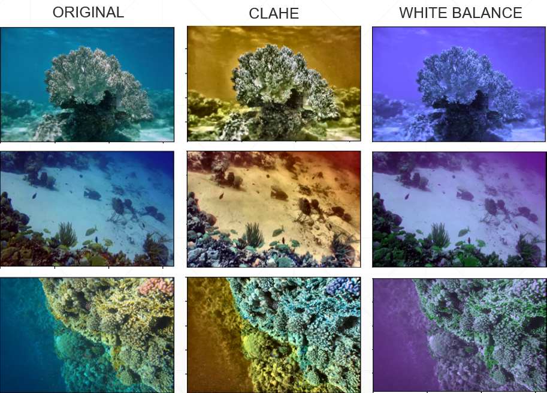

# Zadanie 4
## Segmentation of underwater images
### Autor: Jan Balucha
### Dataset: https://www.kaggle.com/datasets/ashish2001/semantic-segmentation-of-underwater-imagery-suim
### Run report: https://api.wandb.ai/links/gh0stadian/01evn7js

## About

In this project we will try to segment underwater images. 
We will use the dataset from Kaggle, link is above.
To find best approach we will experiment with different model variations and augmentation techniques.
For each experiment we logged results to Weights&Biases, link also above. 
There can be seen complete compatision of all experiments with metrics and valid examples of segmentation for each epoch. 


## Dataset
The dataset contains 1500 images of underwater scenes. 
Each image has a corresponding pixel to pixel mask. The classes are highly imbalanced.

Masks contain 8 classes:
- background
- fish
- human
- robot
- reef
- floor&rocks
- plant
- ruin

## Augmentation
For this project we used torch.transforms library as well as some opencv techniques. 
Mainly we used CenterCrop to crop/pad images to same size. Random rotation and GaussianBlur to limit overfitting and artificially increase dataset size.

For image preprocessing we used CLAHE and White Balance, difference between these methods can be seen on the image below.
CLAHE is limited adaptive histogram equalization. It is used to improve contrast of images.
White Balance is used to remove color cast from images. It is used to make images look more natural.



```python
def clahe(sample, label):
    img_lab = cv2.cvtColor(sample, cv2.COLOR_BGR2LAB)
    l, a, b = cv2.split(img_lab)
    clahe = cv2.createCLAHE(clipLimit=3.0, tileGridSize=(8,8))
    l_clahe = clahe.apply(l)
    img_lab_clahe = cv2.merge((l_clahe,a,b))
    return cv2.cvtColor(img_lab_clahe, cv2.COLOR_LAB2RGB), label

def white_balance(sample, label):
    b_mean = np.mean(sample[:,:,2])
    g_mean = np.mean(sample[:,:,1])
    r_mean = np.mean(sample[:,:,0])
    
    k = (b_mean + g_mean + r_mean) / 3
    
    kb = k / b_mean
    kg = k / g_mean
    kr = k / r_mean

    sample[:,:,2] = cv2.multiply(sample[:,:,2], kb)
    sample[:,:,1] = cv2.multiply(sample[:,:,1], kg)
    sample[:,:,0] = cv2.multiply(sample[:,:,0], kr)

    return sample, label

def random_rotate(sample, label, max_degrees=30):
    degrees = random.randrange(-1 * max_degrees, max_degrees)
    
    sample = imutils.rotate_bound(sample, degrees)
    label = imutils.rotate_bound(label, degrees)
    
    return sample, label
```

## Model
We used U-Net model. It is a fully convolutional neural network used for segmentation and classification. 
In this project we experimented with changing depth of the encoder and decoder, and using different activation functions. 
To limit overfitting we also added dropout layers after each convolutional block.


```python
class DoubleConv(nn.Module):

    def __init__(self, in_channels, out_channels, mid_channels=None,kernel_size=3, padding=1, stride=2, activation="relu"):
        super().__init__()

        if not mid_channels:
          mid_channels = out_channels

        self.double_conv = nn.Sequential(
            nn.Conv2d(in_channels, mid_channels, kernel_size=kernel_size, padding=1, bias=False),
            nn.BatchNorm2d(mid_channels),
            nn.GELU(),
            nn.Conv2d(mid_channels, out_channels, kernel_size=kernel_size, padding=1, bias=False),
            nn.BatchNorm2d(out_channels),
            nn.GELU(),
            nn.Dropout(p=0.1)
        )

    def forward(self, x):
        return self.double_conv(x)

class Down(nn.Module):

    def __init__(self, in_channels, out_channels, activation="relu"):
        super().__init__()
        self.maxpool_conv = nn.Sequential(
            nn.MaxPool2d(2),
            DoubleConv(in_channels, out_channels, activation=activation)
        )

    def forward(self, x):
        return self.maxpool_conv(x)


class Up(nn.Module):

    def __init__(self, in_channels, out_channels, kernel_size=2, activation="relu"):
        super().__init__()

        self.up = nn.Upsample(scale_factor=2, mode='bilinear', align_corners=True)
        self.conv = DoubleConv(in_channels, out_channels, in_channels // 2)

    def forward(self, x1, x2):
        x1 = self.up(x1)
        
        x = torch.cat([x2, x1], dim=1)
        return self.conv(x)


class OutConv(nn.Module):
    def __init__(self, in_channels, out_channels):
        super(OutConv, self).__init__()
        self.conv = nn.Sequential(
            nn.Conv2d(in_channels, 64, kernel_size=1),
            nn.GELU(),
            nn.Conv2d(64, 32, kernel_size=1),
            nn.GELU(),
            nn.Conv2d(32, out_channels, kernel_size=1),
        )

    def forward(self, x):
        return self.conv(x)

class UNetModel(nn.Module):
    def __init__(self, n_channels, n_classes, init_features=64):
        super().__init__()
        self.inc = DoubleConv(n_channels, init_features, kernel_size=3)

        # Downsample
        self.down1 = Down(init_features, init_features*2)
        self.down2 = Down(init_features*2, init_features*4)
        self.bottleneck = Down(init_features*4, init_features*8 // 2)
        
        # Upsample
        self.up1 = Up(init_features*8, init_features*4 // 2) 
        self.up2 = Up(init_features*4, init_features*2 // 2) 
        self.up3 = Up(init_features*2, init_features) 

        self.outc = OutConv(init_features, n_classes)
    
    def forward(self, x):
        x_0 = self.inc(x)

        x_1 = self.down1(x_0)
        x_2 = self.down2(x_1)
        bottleneck = self.bottleneck(x_2)
        x = self.up1(bottleneck, x_2)
        x = self.up2(x, x_1)
        x = self.up3(x, x_0)

        logits = self.outc(x)
        return logits
```

## Run desctiptions
In this section we will mention experiments with link to wandb report and short description of experiment. 
Full comparision of metrics and visualizations can be seen in wandb report in header.

### Run [base_unet](https://wandb.ai/gh0stadian/Povid-4/runs/woz4q0eb)
This run was used as a baseline for all other experiments. 
It was trained on base_unet model downloaded from github with default parameters. 
After training model was segmenting only 2 most common classes from 8 classes total.

### Run [base_unet + gelu](https://wandb.ai/gh0stadian/Povid-4/runs/2b9h19iu)
In this run we tried to use gelu activation function. It was used in all convolutional blocks. 
This run results was worse than baseline. Model basically predicted only one class.

### Run [base_unet + gelu + weighted_loss](https://wandb.ai/gh0stadian/Povid-4/runs/2f3qrehc)
With this run we tried to address class imbalance problem. We used weighted loss function. 
Weights were calculated as (1/8)/proportion. 
The results were also dissapointing because model was prioritizing highly weighted classes. 

### Run [short_unet + focal_loss](https://wandb.ai/gh0stadian/Povid-4/runs/jegcs0tg)
After dissapointing results of weighted loss we tried to use focal_loss which also can address this issue. 
Also we used short_unet model which have smaller depth. 
Focal loss provided best results so far.

### Run [clahe + short_unet + focal_loss](https://wandb.ai/gh0stadian/Povid-4/runs/x4258toy)
In this run we tried to use clahe preprocessing. We also used short_unet model and focal_loss. 
Clahe was used with default parameters. CLAHE yielded worse results than using original image in terms of losses,
but segmentations looked better.

### Run [4x batch size](https://wandb.ai/gh0stadian/Povid-4/runs/i23p75y2)
Here we increased batch size from 4 to 16. We also used short_unet model and focal_loss. 
This was just experiment to see if it will improve results. We saw no improvement in terms of losses, but slightly faster training.

### Run [rotate+gaussian](https://wandb.ai/gh0stadian/Povid-4/runs/6nleov7t)
We tried to limit overfitting by using rotation and gaussian noise augmentation. 
We also used short_unet model and focal_loss. This was attempt to limit overfitting which we saw in previous runs. 
It helped but only slightly.

### Runs [dropout p=0.5](https://wandb.ai/gh0stadian/Povid-4/runs/i8fi7ja0), [dropout p=0.1](https://wandb.ai/gh0stadian/Povid-4/runs/efnf7uv2)
Also method to limit overfitting. We experimented with p values 0.5 and 0.1 for dropout layer. For value 0.5 we saw that model stopped learning after 2 epoch. 
With p=0.1 we saw slightly improvements and yielded best model so far.

### Run [white_balance](https://wandb.ai/gh0stadian/Povid-4/runs/3qep0kzg)
We switched from clahe to white_balance preprocessing. We also used short_unet model and focal_loss. 
White balance was used with default parameters. 
This run was just experiment to see if it will improve results versus clahe. The metrics were worse but segmentations looked on par.